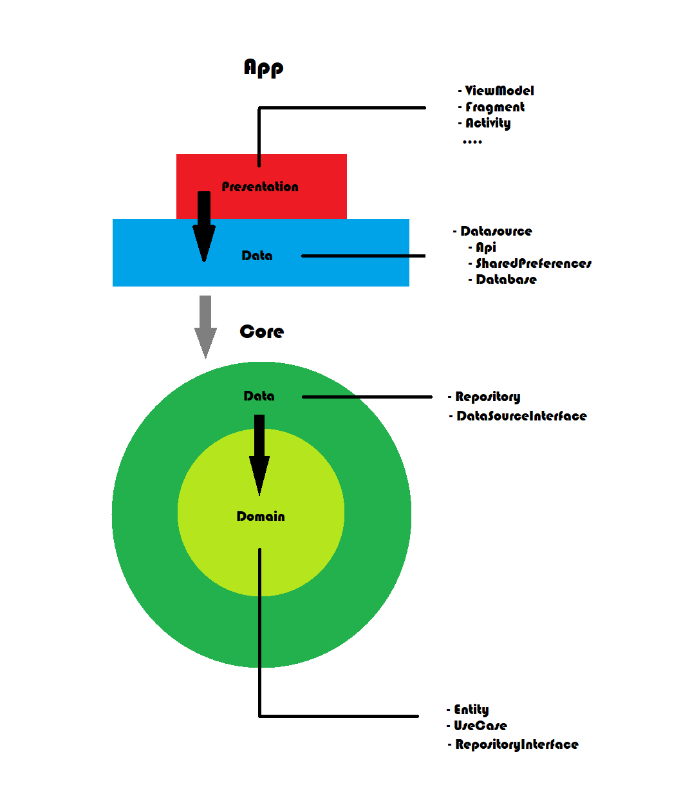

# Mesa News - Clean Architecture

## Aplicativo que possibilita que usuários autenticados visualizem notícias em uma lista infinita, com separação dos destaques em um carrocel que fica no topo. Também é possível favoritar as notícias e visualizá-las em um webview. O usuário que não tiver cadastro poderá se cadastrar no app.

### Arquitetura

O aplicativo foi desenvolvido aplicando a filosofia da arquitetura limpa, onde a aplicação é divida em camadas e o acesso é feito das camadas externas para as camadas internas e uma camada é desacoplada da outra com objetivo de gerar um código facilmente testável, reutilizável e com uma regra de negócio independente de tecnologia.

Estruturalmente os arquivos foram divididos em dois módulos, app e core, a principal diferença entre eles é que o módulo core é totalmente independente de tecnologia e de qualquer coisa que seja considerada um detalhe para a aplicação (web, banco de dados, ui ...), o módulo app conhece o core, o contrário não acontece:

- app
	- data
		... databases e api
	- di 
		... injeção de dependências
	- presentation
		... fragments, viewmodes, activitys
	
- core
	- data
		- dataSource
		- repository
	- domain
		- entity
		- repository
		- useCase

### 🛠 Tecnologias utilizadas

- [koin](https://insert-koin.io/)
- [retrofit](https://square.github.io/retrofit/)
- [navigation](https://developer.android.com/guide/navigation)

### Telas

### Autor

<b>Augusto Flávio</b>

 

